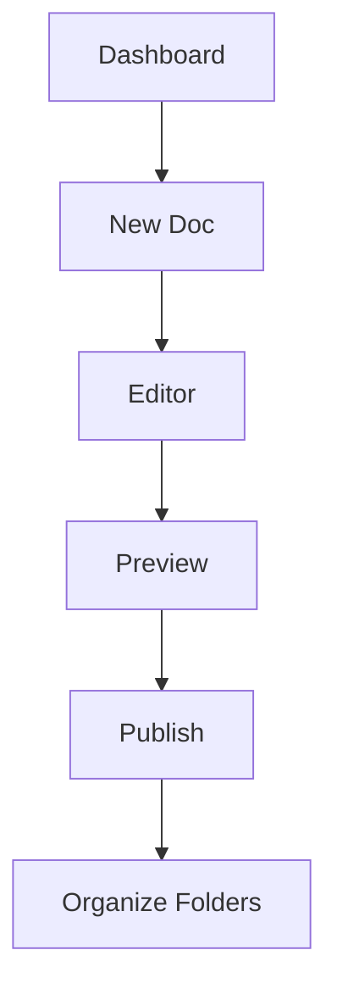

## Overview

Welcome to Abhishikta Ghosh Documentation. You can organize all your project docs here, from API references to user guides. Start by creating your first page, explore the interface, and apply organization tips to keep content structured.

<Callout kind="tip">
  Customize your space with the brand color `#3B82F6` in themes or highlights for a consistent look.
</Callout>

## Create Your First Document

Follow these steps to set up your initial documentation page.

<Steps>
  <Step title="Sign In" icon="user">
    Access the dashboard at your documentation portal. Click `New Document` in the top-right corner.
  </Step>
  <Step title="Add Frontmatter" icon="file-text">
    Begin every page with YAML frontmatter. This sets the title and description.

    ```yaml
    ---
    title: My First Page
    description: Introduction to my project.
    ---
    ```
  </Step>
  <Step title="Write Content" icon="edit-3">
    Use Markdown and MDX components. Preview changes live as you type.
  </Step>
  <Step title="Publish" icon="upload">
    Save and publish. Your page now appears in the navigation sidebar.
  </Step>
</Steps>

## Navigate the Interface

Switch between views using these tabs to edit, preview, and manage your docs.

<Tabs>
  <Tab title="Editor" icon="edit">
    Write Markdown and MDX here. Syntax highlighting helps with code blocks and components.
  </Tab>
  <Tab title="Preview" icon="eye">
    See the rendered page. Test interactive elements like tabs and steps in real-time.
  </Tab>
  <Tab title="Files" icon="folder">
    Organize pages in folders. Drag and drop to reorder or nest content.

    <Image
      src="https://via.placeholder.com/800x400/3B82F6/white?text=Files+View"
      alt="Files view showing folder structure"
      width="800"
      height="400"
    />
  </Tab>
</Tabs>

## Basic Organization Tips

Structure your docs for easy navigation. Use folders for sections like `guides/`, `api/`, and `changelog/`.

<Columns cols={3}>
  <Card title="Use Hierarchies" icon="layout" href="#">
    Nest pages under parent docs. Readers follow logical paths from overview to details.
  </Card>
  <Card title="Add Navigation" icon="menu" href="#">
    Link related pages with Cards or tables of contents. Keep paths short.
  </Card>
  <Card title="Version Content" icon="git-branch" href="#">
    Use branches for releases. Tag changelogs with `<Update>` components.
  </Card>
</Columns>



## Write MDX Examples

Embed code snippets across languages for tutorials.

<CodeGroup tabs="JavaScript,Python">
  ```javascript
  // Fetch documentation data
  const response = await fetch('/api/docs');
  const docs = await response.json();
  console.log(docs);
  ```
  ```python
  # Fetch documentation data
  import requests
  response = requests.get('/api/docs')
  docs = response.json()
  print(docs)
  ```
</CodeGroup>

<Expandable title="Advanced Organization" default-open="false">
  Create a sidebar menu with custom links. Use `slug` in frontmatter for clean URLs like `/guides/quickstart`.

  | Structure | Purpose | Example |
  |-----------|---------|---------|
  | `/guides/` | User tutorials | `/guides/installation` |
  | `/api/` | Endpoint refs | `/api/users` |
  | `/changelog/` | Updates | `/changelog/v1.0` |
</Expandable>

Next, explore API docs or build a changelog with `<Update>` components.