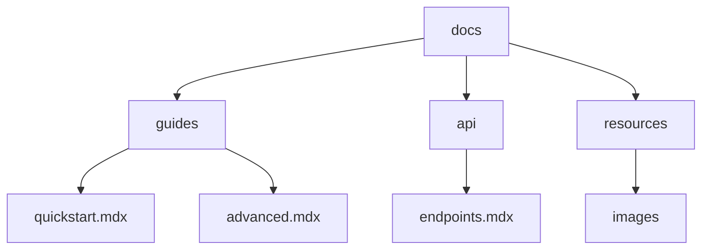

## Overview

Organize your Abhishikta Ghosh Documentation space effectively to keep content accessible and maintainable. Use clear folder structures, leverage collaboration tools, and apply version control basics to streamline workflows. Follow these guidelines to structure pages, enable team contributions, and track changes.

<Callout kind="tip">
  Start with a consistent naming convention like `kebab-case` for files and folders to improve searchability.
</Callout>

## Recommended Folder Structure

Build a logical hierarchy to separate concerns. Common patterns include top-level folders for guides, references, and resources.



<Columns cols={3}>
  <Card title="Guides" icon="book-open" href="#">
    User tutorials and workflows.
  </Card>
  <Card title="API Reference" icon="code" href="#">
    Endpoint details and examples.
  </Card>
  <Card title="Resources" icon="folder" href="#">
    Assets, changelogs, and FAQs.
  </Card>
</Columns>

### Set Up Your Structure

<Steps>
  <Step title="Create Root Folders" icon="folder-plus">
    Add folders like `guides/`, `api/`, and `resources/` at the root.
  </Step>
  <Step title="Add Index Pages" icon="file-text">
    Create `index.mdx` in each folder for navigation summaries.
  </Step>
  <Step title="Nest Subfolders" icon="chevrons-down">
    Use subfolders for complex topics, like `guides/user/` and `guides/admin/`.
  </Step>
</Steps>

## Collaboration Features

Enable team editing with role-based permissions and real-time previews. Assign roles to control access.

<Tabs>
  <Tab title="Editor" icon="edit-3">
    Full write access. Create and update pages directly.

    ```javascript
    // Example: Update frontmatter in MDX
    ---
    title: "My Page"
    description: "Updated content"
    ---
    ```

    <Callout kind="info">
      Use `@mentions` in comments to notify teammates.
    </Callout>
  </Tab>
  <Tab title="Reviewer" icon="eye">
    Read and suggest changes. Preview drafts before publishing.

    Review workflow:
    1. Check structure and links.
    2. Validate code examples.
    3. Approve or request edits.
  </Tab>
  <Tab title="Viewer" icon="user">
    Read-only access for stakeholders.
  </Tab>
</Tabs>

## Version Control Basics

Integrate Git for tracking changes. Commit updates regularly and use branches for major rewrites.

<CodeGroup tabs="Git CLI,GitHub">
  ```bash
  # Initialize repo
  git init

  # Add and commit changes
  git add .
  git commit -m "Add folder structure"

  # Push to remote
  git push origin main
  ```
  ```bash
  # Create GitHub repo and connect
  gh repo create abhishikta-docs --public

  # Pull requests for collaboration
  gh pr create --title "Update guides" --body "Improved structure"
  ```
</CodeGroup>

### Basic Workflow

<Steps>
  <Step title="Branch for Changes" icon="git-branch">
    Run `git checkout -b feature/docs-org`.
  </Step>
  <Step title="Commit and Push" icon="upload">
    Commit with descriptive messages, then push.
  </Step>
  <Step title="Merge via PR" icon="git-pull-request">
    Open a pull request and get reviews before merging.
  </Step>
</Steps>

<Expandable title="Advanced Tips" default-open="false">
  - Use tags like `{["feature", "docs"]}` for filtering changes.
  - Automate deployments with GitHub Actions for live previews.
  - Archive old versions in a `legacy/` folder.

  | Action | Command | Purpose |
  |--------|---------|---------|
  | Tag release | `git tag v1.0` | Mark stable versions |
  | View history | `git log --oneline` | Check recent commits |
  | Revert change | `git revert <hash>` | Undo safely |
</Expandable>

Follow these practices to maintain scalable, collaborative documentation in your Abhishikta Ghosh space. Regularly audit structures and train your team on workflows for long-term success.